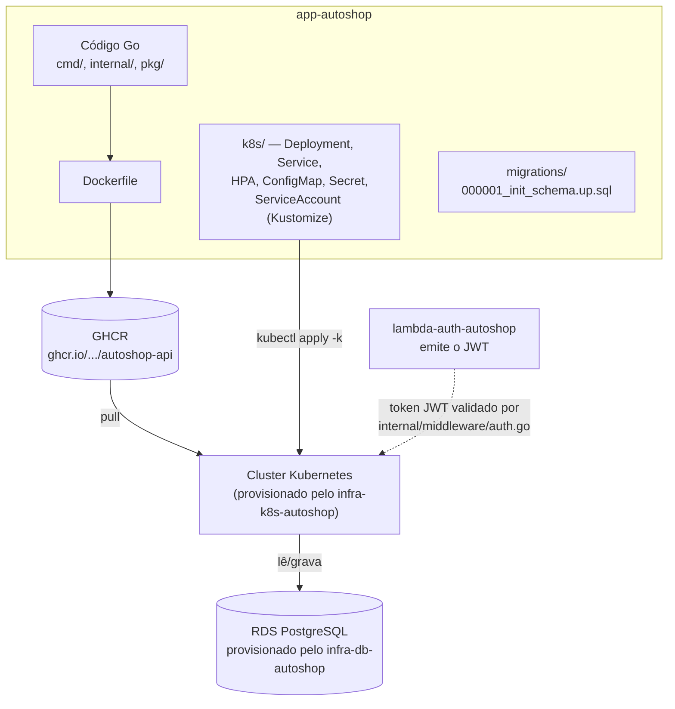

# app-autoshop

Aplicação principal do sistema de gestão de oficina mecânica (autoshop) —
API REST em Go, responsável pelas ordens de serviço (OS), clientes,
veículos, peças e serviços. Roda em Kubernetes.

Este é o repositório 4 dos 4 exigidos pela Fase 3 do Tech Challenge. Os
outros três: [`infra-k8s-autoshop`](https://github.com/Jackeline2020/infra-k8s-autoshop)
(cluster Kubernetes), [`infra-db-autoshop`](https://github.com/Jackeline2020/infra-db-autoshop)
(banco gerenciado) e [`lambda-auth-autoshop`](https://github.com/Jackeline2020/lambda-auth-autoshop)
(autenticação por CPF via Function Serverless).

## Arquitetura deste repositório



Desde a reorganização da Fase 3, este repositório é dono do ciclo de vida
completo da aplicação: código, imagem Docker e os manifestos Kubernetes que
descrevem como ela roda (`k8s/`). O `infra-k8s-autoshop` só provisiona o
cluster em si (cluster, node groups, rede, add-ons) — não sabe nada sobre a
aplicação que roda dentro dele. Essa separação foi um ajuste feito depois
de esclarecimento direto do professor da disciplina.

## Tecnologias

- Go 1.26, Gin (HTTP), pgx (driver PostgreSQL)
- JWT para autenticação (emitido pelo `lambda-auth-autoshop`, validado aqui)
- Docker multi-stage build, imagem final non-root
- Kubernetes (Deployment, Service NodePort, HPA v2, ConfigMap, Secret,
  ServiceAccount), manifestos organizados com Kustomize (`k8s/base` +
  overlays `local`/`aws`)
- GitHub Actions (build, testes, SonarQube Cloud, publicação da imagem,
  deploy)
- SonarQube Cloud (qualidade de código) e `govulncheck` (vulnerabilidades)

## Pré-requisitos

- Go 1.26+
- Docker e docker-compose (execução local)
- Para deploy: acesso aos repositórios `infra-k8s-autoshop` (cluster já
  provisionado) e `infra-db-autoshop` (banco já provisionado, ou Postgres
  local do próprio docker-compose)

## Execução local (sem Kubernetes)

```bash
cp .env.example .env
docker compose up --build
curl http://localhost:8080/health
```

Sobe a API + um Postgres local via docker-compose, aplica a migration
automaticamente. Swagger disponível em `http://localhost:8080/swagger/index.html`
depois de subir.

## Testes

```bash
go test ./internal/domain/... ./internal/usecase/... ./internal/handler/... ./internal/middleware/... ./pkg/... -coverprofile=coverage.out
go test ./internal/integration/... -v   # precisa de um Postgres rodando (ver docker-compose)
```

## Deploy em Kubernetes

### Homologação (branch `develop`)

Automático: a cada push em `develop`, o pipeline publica a imagem e avisa
(`repository_dispatch`) o repositório `infra-k8s-autoshop`, que sobe um
cluster **kind efêmero** dentro do próprio runner do GitHub Actions,
aplica os manifestos deste repositório (buscados via API do GitHub) e faz
um smoke test — tudo sem custo de nuvem. Não precisa de nenhuma ação
manual.

### Produção (branch `main`, cluster EKS real)

Condicionado à variável de repositório `AWS_DEPLOY_ENABLED = true`. Pressupõe que
o `infra-k8s-autoshop` já provisionou o cluster EKS e o `infra-db-autoshop`
já provisionou o RDS. Quando habilitado, o job `deploy-aws` deste
repositório:

1. Se autentica na AWS via OIDC (role compartilhada com o
   `infra-k8s-autoshop`, sem nenhuma chave fixa).
2. Aponta o `kubectl` pro cluster EKS.
3. Injeta os segredos reais (`IRSA_ROLE_ARN`, `DB_HOST`, `JWT_SECRET`) nos
   manifestos via Kustomize.
4. Aplica com `kubectl apply -k k8s/overlays/aws`.
5. Espera o rollout concluir.

Secrets necessários neste repositório: `AWS_ROLE_ARN`, `IRSA_ROLE_ARN`,
`DB_HOST`, `JWT_SECRET`, `SONAR_TOKEN`, `INFRA_K8S_DISPATCH_TOKEN`.
Variável: `AWS_DEPLOY_ENABLED`.

### Deploy manual (fora do fluxo automático)

```bash
kubectl apply -k k8s/overlays/local   # contra um cluster já existente
```

## Pipeline CI/CD (`.github/workflows/ci-cd.yml`)

1. **test** — build + testes unitários com cobertura + SonarQube Cloud.
2. **integration-test** — testes de integração contra um Postgres
   descartável (serviço do próprio job).
3. **build-and-push** — build da imagem Docker, publicação no GHCR.
4. **dispatch-deploy** — (só em `develop`) avisa o `infra-k8s-autoshop`
   pra testar a imagem num cluster kind efêmero (homologação).
5. **deploy-aws** — (só em `main`, se `AWS_DEPLOY_ENABLED=true`) aplica os
   manifestos no cluster EKS real (produção).

## Documentação

- Swagger/OpenAPI: `docs/swagger.json`, `docs/swagger.yaml` (gerados via
  `swag`) — visualizável em `/swagger/index.html` com a API rodando.
- Diagrama de arquitetura geral: [`docs/architecture.md`](docs/architecture.md)
- RFCs: [`docs/rfc/`](docs/rfc)
- Modelo relacional / diagrama ER: [`docs/database/er-diagram.md`](docs/database/er-diagram.md)
