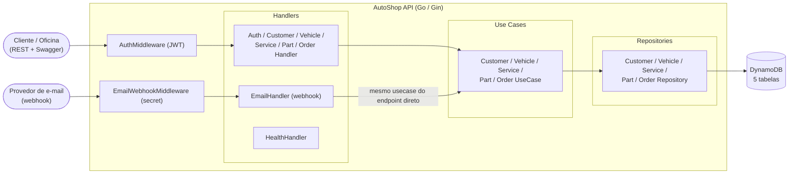
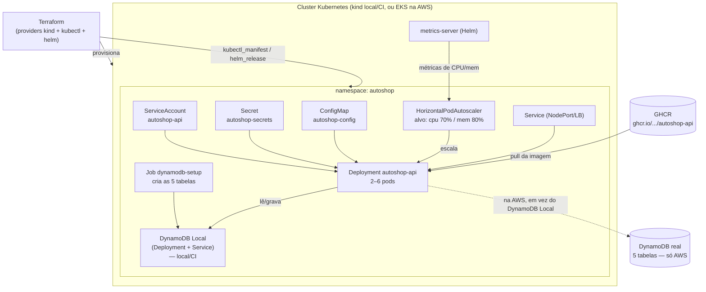
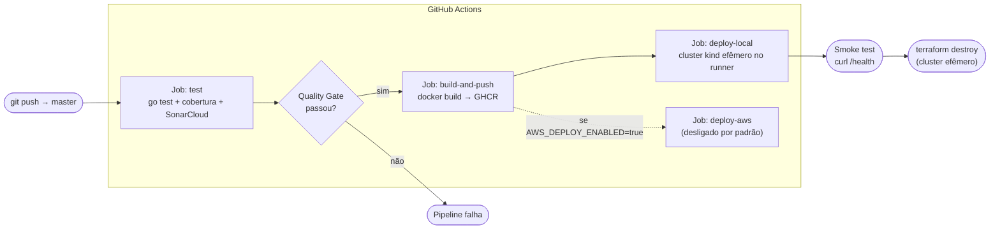

# Arquitetura

Este documento traz os três diagramas da arquitetura proposta: componentes
da aplicação, infraestrutura provisionada e fluxo de deploy.

## Sobre o modelo usado (C4)

Os diagramas seguem a ideia do [C4 Model](https://c4model.com/), que separa
a arquitetura em níveis de zoom — aqui usamos dois deles:

- **Componentes** (nível Component/Container do C4): o que existe *dentro*
  da aplicação e como as peças conversam entre si.
- **Deployment**: onde cada peça roda de fato — cluster, pods, banco,
  registro de imagem.

O terceiro diagrama (fluxo de deploy) — é um fluxo do pipeline de CI/CD.

## Componentes da aplicação

A API segue arquitetura em camadas (Handler → Use Case → Repository). O
webhook de e-mail entra pela mesma porta que qualquer outro adapter: passa
por um middleware próprio de autenticação e cai no mesmo Use Case usado
pelo endpoint HTTP direto — não existe um caminho paralelo de regras de
negócio para atualizações vindas por e-mail.

## Infraestrutura provisionada

Formato comum aos ambientes `local` e `ci` (cluster kind). O ambiente
`aws` (fora do escopo desta entrega) segue a mesma estrutura, trocando o
kind por EKS e o DynamoDB Local por tabelas reais — indicado pela linha
pontilhada.

## Fluxo de deploy

A cada push na `master`, a pipeline testa, publica a imagem e faz o
deploy num cluster efêmero criado dentro do próprio runner do GitHub
Actions — sem depender de custo ou credencial de AWS. O caminho AWS
(`deploy-aws`) existe e está pronto, mas fica desligado por padrão.

