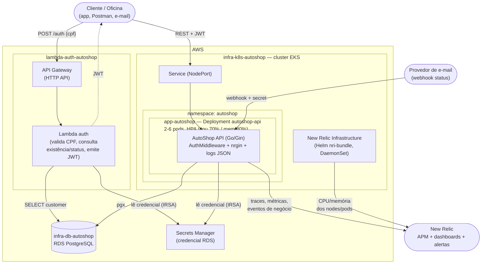
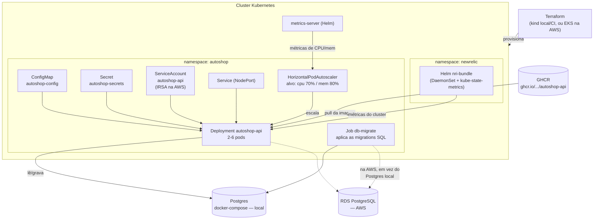
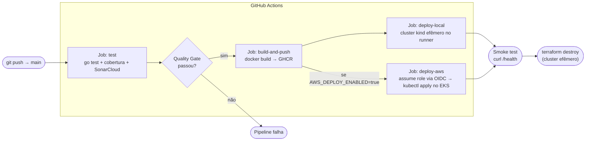

# Arquitetura

Este documento traz os diagramas da arquitetura da Fase 3: componentes da
aplicação com a visão de nuvem completa (APIs, banco, monitoramento),
infraestrutura provisionada no Kubernetes, e o fluxo de deploy da
pipeline. O diagrama de sequência (autenticação por CPF + abertura de OS)
está em [`sequence-diagram.md`](./sequence-diagram.md).

## Sobre o modelo usado (C4)

Os diagramas seguem a ideia do [C4 Model](https://c4model.com/), que separa
a arquitetura em níveis de zoom — aqui usamos dois deles:

- **Componentes** (nível Component/Container do C4): o que existe na
  nuvem, como os 4 repositórios se conectam, e como cada requisito
  obrigatório da Fase 3 (API Gateway, Function Serverless, banco
  gerenciado, monitoramento) se encaixa.
- **Deployment**: onde cada peça roda de fato dentro do cluster —
  namespace, pods, HPA, DaemonSet do New Relic.

O terceiro diagrama (fluxo de deploy) é um fluxo do pipeline de CI/CD.

## Componentes — visão de nuvem, APIs, banco e monitoramento

A API principal segue arquitetura em camadas (Handler → Use Case →
Repository — ver [ADR-002](./adr/ADR-002-padrao-comunicacao.md)). O
webhook de e-mail entra pela mesma porta que qualquer outro adapter: passa
por um middleware próprio de autenticação e cai no mesmo Use Case usado
pelo endpoint HTTP direto — não existe caminho paralelo de regras de
negócio para atualizações vindas por e-mail. A autenticação por CPF é
isolada num repositório e numa Function Serverless próprios, atrás de um
API Gateway dedicado (ver [RFC-003](./rfc/RFC-003-estrategia-autenticacao.md)).

## Infraestrutura provisionada (Kubernetes)

Formato comum aos ambientes `local`/`ci` (cluster `kind`, efêmero, criado
dentro do próprio runner do GitHub Actions) e `aws` (EKS real,
`infra-k8s-autoshop/infra/aws`) — a mesma estrutura de manifestos
(`app-autoshop/k8s`) é aplicada nos dois, o que muda é o Terraform que
provisiona o cluster por trás.

O `Service` da API é `NodePort` nos dois ambientes (não só no `local`) —
decisão deliberada pra manter o mesmo manifesto entre `local`/`ci` e `aws`
sem duplicar overlay só por causa do tipo de Service. Na AWS, os nodes do
EKS ficam em sub-rede pública com IP público próprio, então o `NodePort`
já é alcançável de fora sem custo adicional de um Load Balancer gerenciado
— a porta é liberada pontualmente no security group dos nodes.

## Fluxo de deploy

A cada push na `main`, a pipeline testa, publica a imagem e faz o deploy
num cluster efêmero criado dentro do próprio runner do GitHub Actions —
sem depender de custo ou credencial de AWS para a homologação. O caminho
`deploy-aws` existe e está habilitado (`AWS_DEPLOY_ENABLED=true` em
`app-autoshop` e `infra-k8s-autoshop`), assumindo a IAM role compartilhada
via OIDC (sem access key estática no GitHub).

