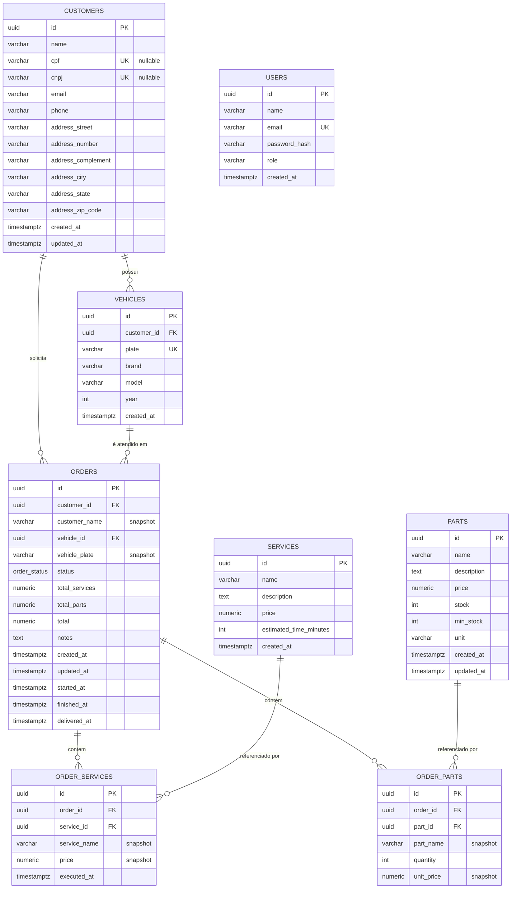

# Modelo Entidade-Relacionamento — PostgreSQL

Este diagrama descreve o schema relacional que substitui as tabelas DynamoDB da Fase 2. Ele deriva diretamente dos structs já existentes em `internal/domain/*.go` — nenhuma regra de negócio foi alterada, apenas a forma como os dados são persistidos.

## Relacionamentos e decisões de modelagem

**CUSTOMERS → VEHICLES (1:N)** e **CUSTOMERS → ORDERS (1:N)**: um cliente pode ter vários veículos e várias ordens de serviço. `vehicles.customer_id` e `orders.customer_id` são chaves estrangeiras `NOT NULL`, refletindo `Order.Validate()` que já exige `CustomerID` e `VehicleID`.

**VEHICLES → ORDERS (1:N)**: cada OS está associada a exatamente um veículo. `ON DELETE RESTRICT` em ambas as FKs de `orders` — não faz sentido apagar um cliente ou veículo que tenha OS associada; isso é uma regra de integridade que o DynamoDB não garantia (a aplicação tinha que checar isso na mão).

**Endereço embutido em `customers`**: `Address` no domínio é 1:1 e nunca reutilizado por outra entidade, então virou colunas prefixadas (`address_*`) na própria tabela em vez de uma tabela `addresses` separada — evita um JOIN desnecessário em toda consulta de cliente, sem perder normalização (não há redundância).

**`orders.customer_name` e `orders.vehicle_plate` também são snapshot**, pelo mesmo motivo do parágrafo abaixo: a OS mantém o nome do cliente e a placa do veículo tal como estavam no momento da abertura, sem depender de um JOIN nem mudar se o cadastro for editado depois.

**`ORDER_SERVICES` e `ORDER_PARTS` guardam snapshot de nome e preço**: isso é proposital, não um erro de normalização. `OrderService.Price` e `OrderPart.UnitPrice` no domínio já capturam o valor no momento da OS — se o preço de um serviço mudar depois, uma OS antiga não pode ser recalculada retroativamente. As FKs (`service_id`, `part_id`) continuam existindo para rastreabilidade, mas o valor histórico vem das colunas snapshot, não de um JOIN com `services`/`parts`.

**`order_status` como ENUM nativo do Postgres** (`recebida`, `em_diagnostico`, `aguardando_aprovacao`, `em_execucao`, `finalizada`, `entregue`, `recusada`): substitui a validação apenas em memória da máquina de estados (`Order.CanTransitionTo`) por uma restrição também no banco — um valor de status inválido não consegue nem ser gravado.

**`cpf` e `cnpj` com `UNIQUE` parcial (`WHERE cpf IS NOT NULL`)**: no domínio, `Customer.Validate()` exige CPF *ou* CNPJ, nunca os dois vazios. O banco reforça isso com um `CHECK (cpf IS NOT NULL OR cnpj IS NOT NULL)` e índices únicos parciais, algo que o DynamoDB não expressa nativamente sem lógica extra na aplicação.

**Chaves primárias `UUID`**: mantém o mesmo formato de ID que já era usado no DynamoDB (string), evitando alterar contratos de API (`internal/dto/*.go`) — os IDs continuam opacos para quem consome a API.
