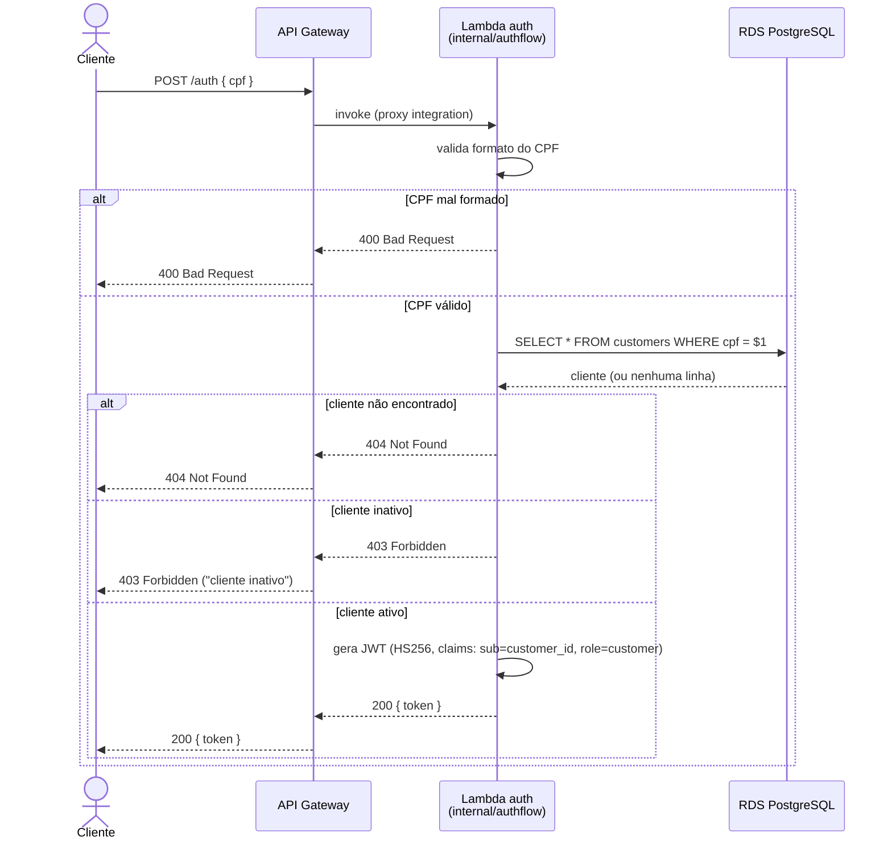
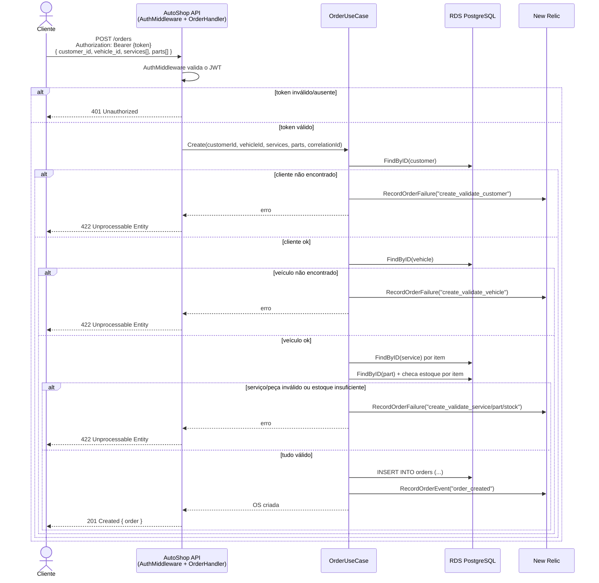

# Diagrama de Sequência

Cobre os dois fluxos exigidos na Fase 3: autenticação via CPF e abertura de
uma ordem de serviço usando o token emitido nesse fluxo.

## 1. Autenticação via CPF

O cliente nunca fala diretamente com o banco nem com a lambda de dentro da
aplicação principal — o fluxo de autenticação é isolado num repositório e
numa Function Serverless própria (`lambda-auth-autoshop`), atrás do API
Gateway. A regra de negócio (validar CPF, checar existência e status do
cliente, emitir o JWT) vive em `internal/authflow`, reaproveitada tanto pelo
handler real da Lambda quanto pelo entrypoint de desenvolvimento local
(`cmd/local`), então o comportamento é idêntico em produção e localmente.

## 2. Abertura de uma ordem de serviço

O token do fluxo acima (ou o token de funcionário, emitido por
`/auth/login`) é usado como `Bearer` na chamada à API principal, que roda
nos pods do EKS. A validação de negócio (cliente, veículo, serviços,
estoque de peças) acontece em sequência no `OrderUseCase.Create`, e cada
etapa — sucesso ou falha — gera um evento de observabilidade (New Relic +
log estruturado), usado pelos dashboards e pelo alerta de falha em OS.

